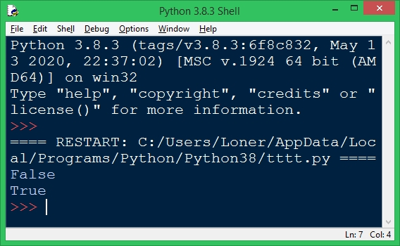

Типізація даних 
========================
Загальні відомості
-------------------------
* Динамічна - одному ідентифікатору можна присвоювати значення різних типів

* Статична - тип значень для ідентифікатора змінної визначається один раз і не може змінюватись

- Слаба - строкове і числове подання одного і того ж числа сприймаються як рівні

- Сильна - строка і число не може бути порівняно

У Python
-------------------------
Динамічна + сильна

**Приклад коду:**

	s = "5"
	d = 5
	print(s == d)
	s = 5
	print(s == d)

*Результат:*

