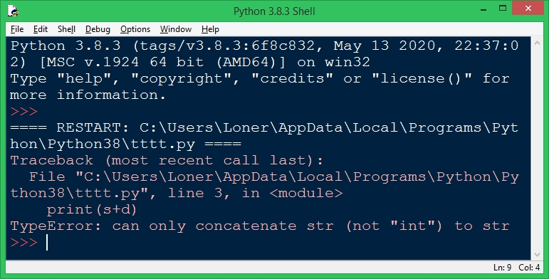

Типізація даних 
========================
Загальні відомості
-------------------------
* Динамічна - одному ідентифікатору можна присвоювати значення різних типів

* Статична - тип значень для ідентифікатора змінної визначається один раз і не може змінюватись

- Слабка - символ інтерпретується як ціле число (код ASCII) і може використовуватись в арифметичних операціях 

>взагалі, як я розумію, це повэязано з 
>можливістю використання вказівника на об'єкт будь-якого похідного класу 
>там, де очікується вказівник на об'єкт базового класу

- Сильна - символ(строка) не сумісний тип з числовим

У Python
-------------------------
Динамічна + сильна

**Приклад коду 1:**

	s = "5"
	d = 5
	print(s+d)

*Результат:*

**Приклад коду 2:**

	s = "5"
	d = 5
	s = 10
	print(s+d)

